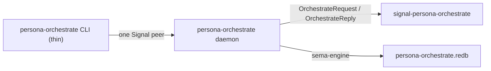

# persona-orchestrate — architecture

*Persona orchestration machinery: role claims, activity, lane/run
coordination, and the daemon boundary that replaces the transitional
workspace lock helper.*

> Status: the repo and ordinary contract exist. The library owns a
> sema-backed claim/activity store today. The long-lived daemon and
> thin CLI are still scaffolded; `~/primary/tools/orchestrate` remains
> the live workspace helper until the daemon is wired.

---

## 0 · TL;DR

`persona-orchestrate` is the component that owns orchestration
machinery. `persona-mind` owns mind state: work graph, thoughts,
relations, memories, and policy truth. Orchestrate owns role claims,
activity, lane/run coordination, scope movement, and the execution
machinery that will sit between mind, router, and harness.

The current implemented slice is the ordinary
`signal-persona-orchestrate` request/reply surface plus a Rust library
that persists claims and activity in `persona-orchestrate.redb` through
`sema-engine`. The shell-era lock files are compatibility projections;
they are not the durable source of truth.



## 1 · Component Surface

This repo contains:

- a library crate, `persona_orchestrate`, that consumes
  `signal-persona-orchestrate` and dispatches typed
  `OrchestrateRequest` values;
- sema-backed `claims`, `activities`, and `activity_next_slot`
  tables;
- claim, release, handoff, role-observation, activity-submission,
  and activity-query handlers;
- a scaffold `persona-orchestrate-daemon` binary.

The full triad shape is daemon + thin CLI + `signal-*` contract. The
contract crate is in `signal-persona-orchestrate`. This repo owns the
runtime and state side of that boundary.

## 2 · State And Ownership

`persona-orchestrate` owns:

- active role claims;
- claim handoff state;
- activity records and store-stamped activity slots;
- eventual lane registry, run lifecycle, scheduling, and supervision
  state.

It does not own:

- mind graph, memories, thoughts, relations, or decisions;
- router delivery queues and channel state;
- harness/terminal process execution;
- BEADS internals.

Durable state lives in this component's own redb file, opened through
`sema-engine`. No other component opens that database directly.

## 3 · Runtime Tables

| Table | Key | Value | Purpose |
|---|---|---|---|
| `claims` | `"<role>|<scope-kind>:<scope>"` | `StoredClaim` | Active role claims. |
| `activities` | `u64` | `StoredActivity` | Store-stamped activity log. |
| `activity_next_slot` | `"next"` | `u64` | Next activity slot. |

Keys are explicit strings, not arbitrary rkyv archives. Values are
typed Rust records archived by the sema storage layer.

## 4 · Constraints

- The ordinary wire surface is `signal-persona-orchestrate`.
- The runtime store is `persona-orchestrate.redb`.
- Activity timestamps are minted by the store, never supplied by the
  caller.
- Claim conflicts reject overlapping path scopes across different
  roles.
- Task scopes overlap only by exact task token.
- Handoff moves ownership atomically from source role to target role.
- `RoleObservation` returns all known role statuses plus recent
  activity.
- The CLI, once wired, talks only to the `persona-orchestrate` daemon.

## 5 · Code Map

```text
src/lib.rs        public library surface and re-exports
src/error.rs      crate error enum
src/location.rs   redb store path wrapper
src/tables.rs     sema-backed claim/activity tables
src/claim.rs      claim, release, handoff, and observation handlers
src/activity.rs   activity submission and query handlers
src/service.rs    OrchestrateRequest dispatch
src/main.rs       daemon scaffold
tests/ledger.rs   sema-backed claim/activity behavior
tests/smoke.rs    legacy claim-state smoke test
```

## See Also

- `../signal-persona-orchestrate/ARCHITECTURE.md` — ordinary wire
  contract.
- `../persona/ARCHITECTURE.md` — Persona component topology.
- `../persona-mind/ARCHITECTURE.md` — mind state boundary.
- `~/primary/skills/component-triad.md` — daemon + thin CLI +
  `signal-*` contract shape.
