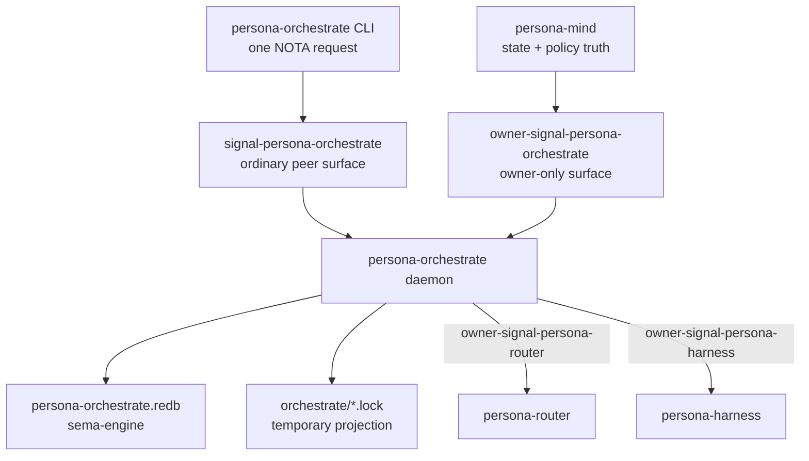

# persona-orchestrate - architecture

*Persona orchestration machinery: role claims, activity, lane/run
coordination, scope acquisition, scheduling, escalation, and the
daemon boundary that replaces the transitional workspace lock helper.*

> Status: the repo and ordinary contract exist. The library owns a
> sema-backed claim/activity store today. The long-lived daemon,
> thin CLI, owner-signal contract, lane-registry table, and lock-file
> projection from daemon state are still missing. `tools/orchestrate`
> remains the live workspace helper until the daemon becomes the
> source of truth.

## 0 - TL;DR

`persona-orchestrate` owns orchestration machinery. `persona-mind`
owns state: work graph, thoughts, memories, relations, durable policy
truth, and channel-grant authority decisions. Orchestrate owns the
mechanics that make work run: claims, handoffs, activity, agent-run
lifecycle, spawn plans, scope acquisition, executor capacity,
scheduling, escalation, and the lane registry.

The current implemented slice is an ordinary
`signal-persona-orchestrate` request/reply surface plus a Rust
library that persists claims and activity in `persona-orchestrate.redb`
through `sema-engine`. The destination is the full component triad:
long-lived daemon, thin `persona-orchestrate` CLI, ordinary
`signal-persona-orchestrate`, owner-only
`owner-signal-persona-orchestrate`, and one sema-engine database split
into policy and working tables.



## 1 - Component Surface

This runtime repo contains:

- a library crate, `persona_orchestrate`, that consumes
  `signal-persona-orchestrate` and dispatches typed
  `OrchestrateRequest` values;
- sema-backed `claims`, `activities`, and `activity_next_slot`
  tables;
- claim, release, handoff, role-observation, activity-submission,
  and activity-query handlers;
- a scaffold daemon binary.

The full component surface is:

```text
persona-orchestrate/
  src/lib.rs
  src/bin/persona-orchestrate-daemon.rs
  src/bin/persona-orchestrate.rs
  bootstrap-policy.nota
signal-persona-orchestrate/
owner-signal-persona-orchestrate/
```

The contract crates carry wire vocabulary only. This repo owns the
runtime, actor tree, socket binding, lock-file projection, and
`persona-orchestrate.redb`.

## 2 - Authority Chain

`persona-mind` owns `persona-orchestrate` through
`owner-signal-persona-orchestrate`. Orchestrate then owns the runtime
execution edges it controls:

| Link | Contract | Direction |
|---|---|---|
| `persona-mind -> persona-orchestrate` | `owner-signal-persona-orchestrate` | mind orders orchestration machinery |
| `persona-orchestrate -> persona-router` | `owner-signal-persona-router` | orchestrate orders channel grants and retractions |
| `persona-orchestrate -> persona-harness` | `owner-signal-persona-harness` | orchestrate orders agent-run lifecycle transitions |

Observation flows back through `Subscribe` surfaces. Authority moves
down through `Mutate` and `Retract`; current state moves up through
subscriptions. No orchestration actor polls another component for
state that component can push.

## 3 - Ordinary Wire Surface

`signal-persona-orchestrate` is the peer-callable surface. It carries
requests peers and the CLI can make without owner authority:

- `RoleClaim` / `RoleRelease` / `RoleHandoff`
- `RoleObservation`
- `ActivitySubmission` / `ActivityQuery`
- destination additions: activity, claim, and lane-registry
  subscriptions

The current contract still uses `RoleName` for lane identity. The
destination replaces closed role-enum churn with a typed
`LaneIdentifier` backed by the runtime lane registry.

## 4 - Owner Wire Surface

`owner-signal-persona-orchestrate` is the owner-only surface to create.
It carries mind's authority over orchestrate policy and machinery:

- agent-run orders: spawn, stop, pause, resume
- scope orders: acquire, release
- policy orders: scheduling and supervision policy
- escalation orders
- lane-registry orders: register lane, retract lane, update lane
  metadata
- owner observations and subscriptions for snapshots, agent lifecycle,
  executor capacity, and scope events

Owner-only operations are inexpressible on the ordinary contract.
The daemon binds a separate socket and actor for this surface.

## 5 - State And Ownership

Durable state lives in one `persona-orchestrate.redb` opened through
`sema-engine`. No other component opens that database directly.

Policy tables change only through owner-signal `Mutate` or `Retract`
after first-start bootstrap:

| Table | Purpose |
|---|---|
| `lane_registry` | registered lanes, assistant-of relation, beads label, metadata |
| `scheduling_policy` | capacity caps, priorities, backpressure rules |
| `supervision_policies` | restart, drain, and escalation policy |

Working tables are produced by operation:

| Table | Purpose | Status |
|---|---|---|
| `claims` | active role claims | implemented |
| `claim_archive` | released or replaced claims | implemented |
| `activities` | store-stamped activity log | implemented |
| `activity_next_slot` | next activity slot | implemented |
| `agent_runs` | agent-run lifecycle records | missing |
| `spawn_plans` | planned executor allocations | missing |
| `agent_executors` | registered execution capacity | missing |
| `scope_acquisitions` | scope request/adjudication flow | missing |
| `channel_grants` | channel rights ordered through router | missing |
| `escalation_state` | blocked work and user-decision state | missing |

The first-start policy seed is `bootstrap-policy.nota`. Once policy
has bootstrapped into sema state, owner-signal is the mutation path.

## 6 - Lock-File Projection

`tools/orchestrate` writes `orchestrate/*.lock` today. That is the
transitional surface. In the component shape, the daemon owns typed
claim state and projects lock files as compatibility output for
human and cross-harness visibility.

The projection is downstream of accepted state mutation. Lock files
are never the source of truth once the daemon is live.

## 7 - Constraints

- The CLI accepts exactly one NOTA request and talks to exactly one
  Signal peer: the `persona-orchestrate` daemon.
- The daemon's external traffic is Signal frames only.
- The daemon has one typed actor per Signal contract socket.
- The ordinary socket accepts ordinary frames; the owner socket
  accepts owner frames; each rejects the other's vocabulary.
- The runtime store is `persona-orchestrate.redb`.
- Activity timestamps and slots are minted by the store, never by the
  caller.
- Claim conflicts reject overlapping path scopes across different
  lanes.
- Task scopes overlap only by exact task token.
- Handoff requires the source lane to hold the exact scope being
  handed off.
- Claiming a directory claims every path below it; there is no
  directory-minus-file handoff shape.
- Lane registry changes are owner-authority operations, not contract
  enum additions.
- Lock files are projections of typed state, not durable authority.
- BEADS is never an owned claim scope.

## 8 - Invariants

- Mind owns state; orchestrate owns machinery.
- The lane registry is data, not a closed role enum.
- Owner authority enters through `owner-signal-persona-orchestrate`;
  ordinary peers cannot compile owner-only orders.
- Push subscriptions carry current state and deltas; polling is not an
  orchestration mechanism.
- The component can be used in raw form before every downstream
  integration is wired, but the raw form still follows the triad.

## Code Map

```text
src/lib.rs        public library surface and re-exports
src/error.rs      crate error enum
src/location.rs   redb store path wrapper
src/tables.rs     sema-backed claim/activity tables
src/claim.rs      claim, release, handoff, and observation handlers
src/activity.rs   activity submission and query handlers
src/service.rs    OrchestrateRequest dispatch
src/main.rs       daemon scaffold
tests/ledger.rs   sema-backed claim/activity behavior and boundary witnesses
tests/smoke.rs    legacy claim-state smoke test
```

## See Also

- `../signal-persona-orchestrate/ARCHITECTURE.md` - ordinary wire
  contract.
- `../persona/ARCHITECTURE.md` - Persona component topology.
- `../persona-mind/ARCHITECTURE.md` - mind state boundary.
- `/home/li/primary/orchestrate/ARCHITECTURE.md` - workspace helper
  today and component destination.
- `/home/li/primary/skills/component-triad.md` - daemon + CLI +
  ordinary/owner contract invariants.
