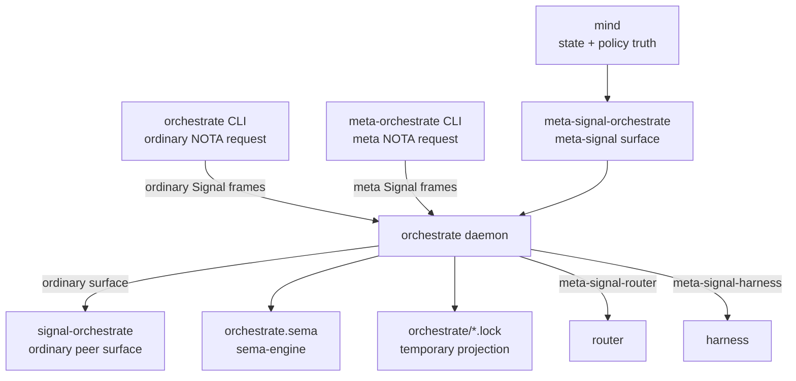

# orchestrate - architecture

*Persona orchestration machinery: role claims, activity, lane/run
coordination, scope acquisition, scheduling, escalation, and the
daemon boundary that replaces the transitional workspace lock helper.*

> Status: the repo, ordinary contract, meta-signal contract, sema-backed
> claim/activity store, dynamic role registry, raw role-creation path,
> local repository-index refresh, triad-runtime multi-listener socket
> runtime, bounded request workers, and ordinary/meta thin CLI clients
> exist. The CLIs have no direct-store path. Lock-file projection from daemon state
> exists. Ordinary and meta daemon sockets validate the Signal
> `ShortHeader` against the decoded request root before dispatch. The
> runtime can now encode, validate, decode, and restore an orchestrate
> Mirror snapshot carried by
> `signal-version-handover::MirrorPayload`; the private upgrade socket
> handler now serves marker/readiness/completion and Mirror restore
> frames. GitHub/ghq-backed report-repository creation is still
> missing.
> The live production surface is the real component CLI pair with one
> NOTA argument each: `orchestrate` for ordinary operations and
> `meta-orchestrate` for meta-policy operations. The old
> `tools/orchestrate` argv-compatible helper is retired, not extended.
> A managed user service is still missing; until then the daemon is
> started by deployment/session setup rather than by keeping a
> compatibility grammar alive.

## Direction

The psyche wants `orchestrate` to move forward now so the workspace can
replace the old shell-script orchestration helper with the real
component. The replacement target is not legacy argv compatibility: the
two one-argument NOTA clients talking to `orchestrate-daemon` are the
complete production surface, and callers migrate to NOTA operations
instead of preserving the `claim/release/status` argv grammar.

The immediate MVP creates dynamic roles named by the work they own,
creates report lanes for those roles, and tracks enough typed claim
state to replace the fixed assistant-lane lock files. Harness assignment
is a typed role field — `Codex` or `Claude` in the MVP — never hidden
inside the role string.

Repository management starts from local checkouts: refresh local
repository state and link checkouts into the workspace first, then add
GitHub/ghq remote creation after the raw shape is useful. A component
may ship in raw form before full cross-component wiring; the raw form
still follows the triad.

Per archived intent `5d5o`, `orchestrate` is kept on the current triad,
signal, sema, and runtime crate set: the path forward is updating the
component dependency surface, not compatibility-helper lockfile work.

Per archived intent `potn`, dynamic topic-named lanes are the target lane
model. A lane is a unique work-session identity for lock ownership and agent
flow — such as `design-psyche-alignment` — and discipline or role becomes
metadata for skill and authority loading rather than the whole lane name. The
current fixed role-shaped lanes remain a compatibility shim until orchestrate
supports dynamic lane registration. (`udgu`'s decision — lane and claim
management runs through the orchestrate daemon's one-argument ordinary/meta
NOTA CLIs as the complete production surface, with the older `tools/orchestrate`
helper retired rather than maintained — is already stated in **Status**, the
**TL;DR**, and **§8 Invariants**.)

Per archived intent `irmw`, roles in the lane registry are NOTA vectors of
identifier tokens (e.g. `[PersonaSignal Designer]`). The last token is the
base discipline (authority chain plus skill loading); preceding tokens are
specializations. The filesystem form is the hyphen-joined lowercase rendering
(`[Note Designer]` → `note-designer`). Tokens are open identifiers; ordinal
prefixes (`second-`, `third-`) only disambiguate same-role lanes.

## 0 - TL;DR

`orchestrate` owns orchestration machinery. `mind`
owns state: work graph, thoughts, memories, relations, durable policy
truth, and channel-grant authority decisions. Orchestrate owns the
mechanics that make work run: claims, handoffs, activity, agent-run
lifecycle, spawn plans, scope acquisition, executor capacity,
scheduling, escalation, and the lane registry.

The current implemented slice is the usable triad skeleton: ordinary
`signal-orchestrate` request/reply surface, meta-signal
`meta-signal-orchestrate`, a daemon that owns the
`orchestrate.sema` sema store, and a thin
`orchestrate` CLI for ordinary working operations plus a thin
`meta-orchestrate` CLI for meta-policy operations. Both send Signal
frames to the daemon sockets. The workspace `tools/orchestrate` wrapper is
retired compatibility, not a second state owner and not the agent-facing
syntax.

## Migration history - contract-local verbs and generated execution

The runtime consumes `signal-frame` contracts with public
contract-local operation roots. The old public `SignalVerb` wrapper is
gone from both Orchestrate contracts. Under the three-layer model
affirmed 2026-05-20 (per
`~/primary/skills/component-triad.md` §"Verbs come in three layers"
and
`primary/reports/designer/246-v4-bundled-fix-deep-design-with-examples.md`),
the runtime owns its internal Nexus feature surface (Layer 2) and can
project contract operations to payloadless `signal-sema::SemaOperation`
class labels (Layer 3) for cross-component observation via
`ToSemaOperation`. Sema classes are observation-only; they do not carry
executable payloads on the wire.

Execution now enters the generated Nexus/SEMA path. The ordinary and
meta request handlers project public contract payloads into
`schema::nexus::SignalInput`, drive
`OrchestrateNexusEngine` through the generated `NexusEngine` trait,
and delegate durable reads/writes to `OrchestrateSemaEngine` through
the generated `SemaEngine` trait. The previous hand-written
`signal-executor` lowering and command-executor implementation has
been removed from the runtime dependency graph. `OperationLowering`
remains only as an observation-classification helper for the current
tests and compatibility vocabulary.

The daemon/CLI boundary did not change: each CLI remains a thin
NOTA-to-Signal adapter for one contract tier, and the daemon remains
the only process that opens `orchestrate.sema`.

Workflow execution now has an additive resolved run path. Callers may submit a
`RunResolvedWorkflow` request carrying a provider-neutral harness
`ModelResolutionRequest`: exact model or capability/profile selector, effort,
and a generic continuation policy (`Fresh`, `Prefer`, or `Require`).
`orchestrate` sends that request to `harness` through the privileged
`meta-signal-harness` `ResolveModel` operation, then stores the returned
`ModelResolved` or `ModelUnavailable` in its sema table keyed by a resolved
workflow run handle that includes the model-resolution request identity. The
returned `ContinuationHandle` remains the harness contract's opaque enum
payload; orchestrate stores and returns it without branching on Claude, Codex,
or Pi continuation internals. Unavailability is surfaced as the typed
workflow-resolution unavailable reply; this slice deliberately does not choose a
fallback silently. Model resolution acceptance is a resolution state, not an
authorized workflow receipt.



## 1 - Component Surface

This runtime repo contains:

- a library crate, `orchestrate`, that consumes
  `signal-orchestrate` and dispatches typed
  `OrchestrateRequest` values;
- sema-backed `claims`, `roles`, `repositories`, `activities`, and
  `activity_next_slot` tables;
- claim, release, handoff, role-observation, activity-submission,
  and activity-query handlers;
- observation subscription open/close handlers for the public
  observer hook;
- meta-request handlers for role creation, role retirement, and
  local repository-index refresh;
- compatibility lock-file projection from accepted daemon state into
  workspace `orchestrate/<role>.lock` files;
- a daemon binary that accepts one NOTA config argument, binds
  ordinary, meta, and private upgrade Unix sockets through
  `triad-runtime::MultiListenerDaemon`, handles requests on bounded
  workers, decodes Signal frames, dispatches to the service, validates
  frame short headers before dispatch, and writes Signal replies;
- an ordinary thin CLI client, `orchestrate`, whose ordinary contract input is
  shorthand for a typed human presentation and whose one-argument explicit
  invocation selects `Human` or exact `Canonical` output before it encodes the
  unchanged `signal-orchestrate` request as a Signal frame and connects only to
  the ordinary daemon socket;
- a meta-policy thin CLI client, `meta-orchestrate`, that accepts one
  `meta-signal-orchestrate` NOTA request argument, encodes it as a
  Signal frame, and connects only to the meta daemon socket.
- a Mirror snapshot layer for version handover: `src/handover.rs`
  captures active claims and lane registrations, archives them as the
  payload bytes in `signal-version-handover::MirrorPayload`, validates
  component/kind/target-version on receive, and restores the decoded
  state into the local sema tables.
- a private upgrade-socket handler for `signal-version-handover`
  frames. It answers `AskHandoverMarker`, records
  `ReadyToHandover`, retires ordinary/meta socket paths after
  `HandoverCompleted`, accepts orchestrate `MirrorPayload` snapshots
  in the marker-to-readiness window, and maps invalid mirror payloads
  to typed handover rejections.

The full component surface is:

```text
orchestrate/
  src/lib.rs
  src/main.rs
  src/bin/orchestrate.rs
  src/bin/meta_orchestrate.rs
  bootstrap-policy.nota
signal-orchestrate/
meta-signal-orchestrate/
```

The contract crates carry wire vocabulary only. This repo owns the
runtime, actor tree, socket binding, lock-file projection, and
`orchestrate.sema`.

## 2 - Authority Chain

`mind` owns `orchestrate` through
`meta-signal-orchestrate`. Orchestrate then owns the runtime
execution edges it controls:

| Link | Contract | Direction |
|---|---|---|
| `mind -> orchestrate` | `meta-signal-orchestrate` | mind orders orchestration machinery |
| `orchestrate -> router` | `meta-signal-router` | orchestrate orders channel grants and retractions |
| `orchestrate -> harness` | `meta-signal-harness` | orchestrate orders agent-run lifecycle transitions |

Observation flows back through subscription surfaces. Authority moves
down through meta-signal contract operations, which the daemon lowers to
Sema mutations or retractions internally. No orchestration actor polls
another component for state that component can push.

## 3 - Ordinary Wire Surface

`signal-orchestrate` is the peer-callable surface. It carries
requests peers and the CLI can make without meta authority:

- `Claim(RoleClaim)` / `Release(RoleRelease)` /
  `Handoff(RoleHandoff)`
- `Observe(RoleObservation)`
- `Submit(ActivitySubmission)` / `Query(ActivityQuery)`
- `Watch(ObservationSubscription)` / `Unwatch(ObservationToken)`

The current ordinary contract uses `RoleIdentifier` for dynamic role
identity. `RoleName` remains as a compatibility alias only; role
creation is data in the runtime registry, not a contract enum edit.

## 4 - Meta Wire Surface

`meta-signal-orchestrate` is the meta-signal surface. The
implemented MVP carries:

- `Create(CreateRoleOrder)`
- `Retire(RetireRoleOrder)`
- `Refresh(RefreshRepositoryIndexOrder)`

Destination additions include agent-run orders, scope acquisition
orders, scheduling/supervision policy, escalation orders, and meta
subscriptions for snapshots, agent lifecycle, executor capacity, and
scope events.

Meta-signal operations are inexpressible on the ordinary contract.
The daemon binds a separate socket and actor for this surface.

## 5 - State And Ownership

Durable state lives in one `orchestrate.sema` opened through
`sema-engine`. No other component opens that database directly.

`orchestrate.sema` runs the sema-engine local-checkpoint recovery
topology: this daemon has no mirror, and its store carries no live
outbox obligation. Any historical outbox rows in it are vestige of
pre-topology engine generations that wrote the outbox unconditionally;
local-checkpoint compaction trims them and never blocks on them. The
version-handover `Mirror` payload elsewhere in this document is
unrelated — an in-process upgrade snapshot, not the mirror daemon.

Policy tables change only through meta-signal contract operations
after first-start bootstrap. The daemon lowers those operations to
Sema effects internally:

| Table | Purpose |
|---|---|
| `roles` | dynamic role registry, harness kind, report repository path, report lane path |
| `repositories` | refreshed local checkout index and workspace link metadata |
| `lane_registry` | registered lanes, assistant-of relation, beads label, metadata |
| `scheduling_policy` | capacity caps, priorities, backpressure rules |
| `supervision_policies` | restart, drain, and escalation policy |

Working tables are produced by operation:

| Table | Purpose | Status |
|---|---|---|
| `claims` | active role claims | implemented |
| `claim_archive` | released or replaced claims | missing |
| `activities` | store-stamped activity log | implemented |
| `activity_next_slot` | next activity slot | implemented |
| `agent_runs` | agent-run lifecycle records | missing |
| `spawn_plans` | planned executor allocations | missing |
| `agent_executors` | registered execution capacity | missing |
| `scope_acquisitions` | scope request/adjudication flow | missing |
| `channel_grants` | channel rights ordered through router | missing |
| `divergences` | partial downstream mutation successes/failures recorded for recovery | implemented |
| `escalation_state` | blocked work and user-decision state | missing |

The first-start policy seed is `bootstrap-policy.nota`. Once policy
has bootstrapped into sema state, meta-signal is the mutation path.

## 6 - Lock-File Projection

`orchestrate` submits typed NOTA requests to `orchestrate-daemon`. The daemon
owns typed claim state and projects `orchestrate/*.lock` files as compatibility
output for human and cross-harness visibility.

The projection is downstream of accepted state mutation. Lock files
are never the source of truth once the daemon is live. Every registered
role gets an `orchestrate/<role>.lock` file. Empty files mean idle;
claimed path scopes render as:

```text
<absolute-path> # <reason>
```

Task scopes render in bracketed human form:

```text
[<task-token>] # <reason>
```

## 7 - Constraints

- The CLI accepts exactly one NOTA invocation and talks to exactly one Signal
  peer: the `orchestrate` daemon. Ordinary contract input lowers to `Human`
  presentation; for example, `(Explicit (Canonical (Observe Lanes)))` retains
  the exact canonical contract reply. Presentation never crosses the daemon
  boundary.
- The CLI never opens `orchestrate.sema`, sema-engine, or the
  in-process `OrchestrateService`; all state mutation and reads cross
  the daemon boundary.
- The daemon's external traffic is Signal frames only.
- The daemon has one typed listener and dispatch path per Signal
  contract socket.
- The daemon uses `triad-runtime::MultiListenerDaemon` and
  `BoundedWorkers`; it does not own ad hoc socket accept loops or
  unbounded request threads.
- The ordinary socket accepts ordinary frames; the meta socket
  accepts meta frames; the private upgrade socket accepts
  `signal-version-handover` frames; each rejects the other's
  vocabulary.
- The daemon validates the incoming frame `ShortHeader` against the
  decoded request root before dispatch; mismatched or unknown root
  bytes are rejected before service state can mutate.
- Contract operations lower to Sema effects inside the runtime, not in
  the contract crates.
- Public observer subscriptions allocate typed observation tokens on
  the ordinary socket.
- The runtime store is `orchestrate.sema`.
- Activity timestamps and slots are minted by the store, never by the
  caller.
- Claim conflicts reject overlapping path scopes across different
  lanes.
- Task scopes overlap only by exact task token.
- Handoff requires the source lane to hold the exact scope being
  handed off.
- Claiming a directory claims every path below it; there is no
  directory-minus-file handoff shape.
- Lane registry changes are meta-authority operations, not contract
  enum additions.
- The lane registry reflects only real lanes: a lane's `updated_at` is its
  last-activity stamp, refreshed on every real use (claim, release, handoff,
  recovery re-registration). A `LaneReaper` reconciles at daemon startup and
  through a lifecycle-driven deadline worker: each lane mutation publishes the
  next expiry, the worker sleeps until that one deadline, then re-enters through
  the ordinary Signal path for actor-owned reclamation. It is not an interval
  poll and does not require a human Observe call. Terminal records past a short
  retention window and `Active` lanes idle past a generous liveness window are
  hard-deleted with their claims. Windows are tunable constants in `src/lane.rs`
  (terminal 1h, active idle 24h).
- Because only real lanes count, registration reads a lane's identity, not its
  history. A terminal record (`Released` / `HandoverEnded`) never blocks: a
  `Fresh` registration over one supersedes it — the dead record and its stale
  claims are dropped and the lane is registered anew in one operation — so
  "Fresh follows the closed lane record" is literally true, and the short
  retention window keeps a closed record for inspection, never to squat its
  name. The only real registration that a `Fresh` request conflicts with, or a
  `Recovery` request inherits, is a live `Active` lane of the same name: `Fresh`
  is refused (`FreshConflict`), `Recovery` inherits it and refreshes its
  liveness stamp (`RecoveryInherited`). Over a terminal or absent record both
  modes converge — the lane is genuinely (re)registered and the reply is a
  truthful `LaneRegistered`, never a silent no-op behind a success variant.
- The other stores that grew without a removal path are bounded by the same
  idle-age discipline, in `src/table_reclamation.rs`'s `BoundedTableReaper`: the
  orchestrator agent registry (an `Active` agent idle past its liveness window
  retires; a `Retired` agent past its terminal retention is deleted with its
  topic seats; `last_activity` is refreshed on registration, reachability
  discovery, and each triaged message it sends, and clearing a session retires
  its agents), topic membership (reaped with the agent that held it), the topic
  registry (an empty, childless topic aged past retention is reaped), the
  workflow model-resolution table (a resolution reaped past its retention), and
  the worktree index (a concluded tombstone — `Recycled`/`Archived`/`Merged` —
  reaped past retention, while `Active` work stays and `Abandoned` rows are left
  for the `ConcludeWorktree` reclaim path). Reconciliation runs at startup and at
  the head of every ordinary engine turn, and the single reclamation worker's
  next deadline is the earliest expiry across the lanes and these tables — the
  same push-not-pull, reaped-only-by-its-own-idle-age invariant, never an
  interval scan. This reaping is an **interim** mechanism, not the final design:
  the psyche's standing direction is that these lanes and tables should
  ultimately be "handled more smartly with a mind combination", and that a store
  that grows is acceptable only "as long as we also document their age" — which
  the relative-age display surfaces. Until that smarter handling exists, the
  reaper keeps every store bounded. Windows are tunable constants in
  `src/table_reclamation.rs`.
- Harness liveness is kernel-pushed, not aged (`src/harness_liveness.rs`,
  layer 1 of the coordination-liveliness design): the daemon holds a `pidfd`
  on every `Active` agent's discovered harness process (the pid pinned by its
  `/proc` start time, so a recycled pid is never mistaken for the agent's
  harness), and a process exit makes the pidfd readable — the
  `HarnessLivenessWatch` worker re-enters through the ordinary Signal path,
  exactly like the lane reclaimer. The truth transition never trusts the wake:
  at the head of every ordinary turn `HarnessLivenessReconciliation` reads
  `/proc` and marks the typed `OrchestratorAgentStatus::Dead` on every `Active`
  agent whose pinned generation is gone. `Dead` is terminal beside `Retired`
  (same retention, distinct meaning: dead agents are the messenger's
  killed-mark source and are bounced-to, never respawn-delivered). Agents
  without discovered reachability have no pid to watch and stay on the
  idle-age backstop.
- The idle-aged retire decision reads real activity first
  (`src/activity_read.rs`, layer 3 of the coordination-liveliness design,
  psyche-ruled: "better to actually read the agent's latest activity; a single
  command could take hours"). When an `Active` agent's idle age reaches the
  reaper's retire decision — and only then; nothing scans on a clock —
  `AgentActivityRead` reads the agent's genuine latest activity: a live
  descendant of the pinned harness process (a running command, however long)
  or a terminal-cell session artifact written after the stored stamp is
  positive liveness that refreshes `last_activity` and re-arms the idle
  deadline; a silent, childless agent retires as before. The descendant scan
  only trusts a live generation pin, so a recycled pid's children are never
  attributed to the agent.
- Role creation records a typed harness kind beside the role
  identifier; harness assignment is not hidden in the role string.
- Role creation creates a report-repository path and report-lane path
  before inserting the role record.
- A fanned-out Mutate that has at least one downstream success and at
  least one downstream failure records a divergence and returns a typed
  `PartialApplied` reply instead of rolling back the successful leg. Activities,
  divergences, and orchestrator triage audit rows are bounded current-reality
  windows, not unbounded historical ledgers.
- Repository refresh reads local checkouts from the configured Git
  index root and creates workspace `repos/` links.
- Lock files are projections of typed state, not durable authority.
- Version handover Mirror payloads for orchestrate carry
  `MirrorSnapshot` records: active claims plus lane registrations.
  Component name, record kind, target contract version, and archive
  validity are checked before state restoration.
- Version handover Mirror restore happens before readiness for
  orchestrate. Completion retires the ordinary and meta socket paths;
  the upgrade socket remains available for private recovery protocol.
- BEADS is never an owned claim scope.
- Worktree lifecycle is daemon-owned. Ordinary `RequestWorktree` resolves
  the indexed repository checkout, scaffolds a `jj` workspace from `main` at
  the canonical worktree path, creates its feature bookmark, derives
  infrastructure facts, and records its purpose and owner. Ordinary
  `ConcludeWorktree` is the only teardown path: `Merged` auto-lands by
  rebase and only then forgets the workspace and removes its directory;
  `Rejected` pushes `discard/<branch>` before removal. Meta
  `RegisterWorktree` and `RefreshWorktreeIndex` reconcile existing
  checkouts, while `ArchiveWorktree` moves a named path to
  `WorktreeStatus::Archived`. A refresh is a filesystem discovery floor:
  for a known `(repository, branch)` it re-derives only `jj` facts and
  preserves the durable owner, purpose, and lifecycle state instead of
  replacing them with scanner guesses. `WorktreeProjection::gc_candidates`
  reads the `Archived`/`Recycled` projection entries back for later GC.
  Infrastructure-minted fields (`last_activity`, `pushed_state`) are derived
  from `jj` by the daemon, never agent-supplied.
- The present conclusion request selects its worktree by owning lane even
  though one lane can correctly own worktrees in several repositories. Rather
  than silently choose the first row, conclusion refuses an ambiguous lane
  before it runs any `jj` or filesystem effect. This is a compatibility
  containment, not an identity model: the future public conclusion request
  must carry the exact `(repository, branch)` worktree identity when the new
  schema producer is ready.
- Repository-main contention (contention-flow MVP, psyche-ruled 2026-07-17):
  a claim covering a registered repository whose whole checkout another live
  lane holds is answered `RepositoryMainContended` — holder, held age, and a
  feature worktree scaffolded on the spot with the claimant's lane name as
  the branch (`FeatureWorktree::Scaffolded`/`Existing`). Narrow-path
  conflicts inside a repository keep the plain `ClaimRejection`.
- `ConcludeWorktree(Merged)` lands the work itself — the MVP has no review
  gate ("first MVP doesnt, just merge in main"): work already an ancestor
  passes through (`AlreadyAncestor`); otherwise `AutoLand` fetches, rebases
  the salvage head onto the latest `main`, advances the bookmark, and pushes
  (`FastForwarded`/`Rebased`). A conflicted rebase or a push rejected after
  one retry is fully unwound via `jj op restore` and refused typed
  (`AutoRebaseConflicted`/`MainPushRejected`) — the seam where the deferred
  review gate lands later. `Rejected` conclusions report `Discarded`.
  Releasing a lane whose scopes covered a repository main carries
  `started_branches` in the acknowledgment: the un-integrated feature
  worktrees other lanes started while main was held — a live view of the
  worktree registry, never a separate ledger.

## 8 - Invariants

- Mind owns state; orchestrate owns machinery.
- The lane registry is data, not a closed role enum.
- Meta authority enters through `meta-signal-orchestrate`;
  ordinary peers cannot compile meta-signal orders.
- Push subscriptions carry current state and deltas; polling is not an
  orchestration mechanism.
- The component can be used in raw form before every downstream
  integration is wired, but the raw form still follows the triad.

## Code Map

```text
src/lib.rs        public library surface and re-exports
src/error.rs      crate error enum
src/configuration.rs
                  daemon NOTA config record, including the private
                  upgrade socket path
src/daemon.rs     triad-runtime ordinary/meta/upgrade listener runtime,
                  bounded request workers, and frame dispatch with
                  ShortHeader ingress validation
src/divergence.rs partial downstream application recorder
src/handover.rs   version-handover marker state plus Mirror snapshot
                  encoding, validation, decoding, and restoration
src/location.rs   sema store path wrapper
src/layout.rs     workspace/git-index path policy
src/lock_projection.rs
                  compatibility lock-file projection
src/lowering.rs   contract-operation to Sema-effect lowering
src/tables.rs     sema-backed claim/activity/role/repository tables
src/claim.rs      claim, release, handoff, and observation handlers
src/activity.rs   activity submission and query handlers
src/role.rs       meta role creation and retirement handlers
src/repository.rs local repository-index refresh handler
src/worktree.rs   worktree registry: register, refresh-index, and archive
                  lifecycle handlers; `WorktreePathProbe` derives
                  `PushedState` and `last_activity` from `jj`
src/worktree_projection.rs
                  `worktrees.nota` GC manifest writer (`project`) and
                  reader (`gc_candidates`) — returns entries in
                  `Archived` or `Recycled` status for external GC
src/service.rs    ordinary, meta, and upgrade request dispatch
src/main.rs       daemon binary, one NOTA config argument
src/bin/orchestrate.rs
                  one-line signal_frame::signal_cli! thin client
tests/ledger.rs   sema-backed claim/activity/role/repository and lowering witnesses
                  plus the first record-divergence partial-failure witness
tests/architecture.rs
                  CLI boundary source-scan witnesses
tests/daemon_cli.rs
                  production daemon + production CLI socket witnesses
                  including private upgrade-socket handover witnesses
tests/handover.rs version-handover Mirror payload encode/decode/restore
                  service witnesses
tests/smoke.rs    legacy claim-state smoke test
```

## Schema-Engine Shape

`orchestrate` is on the current schema-engine runtime shape:
`schema/nexus.schema` declares the internal decision plane,
`schema/sema.schema` declares the storage plane, and build-time
generation emits checked-in `src/schema/{nexus,sema,daemon}.rs`.
The ordinary and meta wire contracts remain separate contract crates:
`signal-orchestrate` and `meta-signal-orchestrate`. The daemon schema
imports those wire roots and binds them to distinct ordinary and meta
listener tiers through `triad-runtime`.

`OperationLowering` remains the hand-written contract-to-command
translation point for the service slice that has not yet been
rewritten as generated Nexus decisions. The meta-signal contract
surface (`Create` / `Retire` / `Refresh`) is distinct from the
ordinary surface (`Claim` / `Release` / `Handoff` / `Observe` /
`Submit` / `Query` / `Watch` / `Unwatch`); both are inexpressible on
the wrong socket. The sema-backed `claims`, `roles`, `repositories`,
`activities`, `activity_next_slot`, and `divergences` tables are
registered through `sema-engine` and opened at `orchestrate.sema`.
Lock-file projection remains downstream of accepted daemon state.

## See Also

- `../signal-orchestrate/ARCHITECTURE.md` - ordinary wire
  contract.
- `../meta-signal-orchestrate/ARCHITECTURE.md` - meta wire
  contract.
- `../signal-frame/ARCHITECTURE.md` - Signal frame kernel.
- `../signal-sema/ARCHITECTURE.md` - lower Sema operation vocabulary.
- `../persona/ARCHITECTURE.md` - Persona component topology.
- `../mind/ARCHITECTURE.md` - mind state boundary.
- `/home/li/primary/orchestrate/ARCHITECTURE.md` - workspace helper
  today and component destination.
- `/home/li/primary/skills/component-triad.md` - daemon + CLI +
  ordinary/meta-signal contract invariants.
