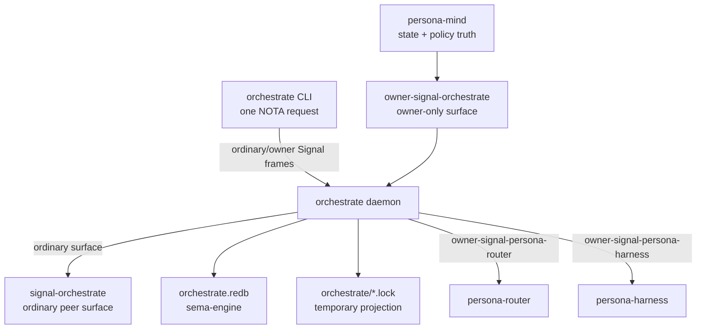

# orchestrate - architecture

*Persona orchestration machinery: role claims, activity, lane/run
coordination, scope acquisition, scheduling, escalation, and the
daemon boundary that replaces the transitional workspace lock helper.*

> Status: the repo, ordinary contract, owner contract, sema-backed
> claim/activity store, dynamic role registry, raw role-creation path,
> local repository-index refresh, daemon socket runtime, and thin CLI
> client exist. The CLI has no direct-store path. Lock-file projection
> from daemon state exists. GitHub/ghq-backed report-repository
> creation is still missing.
> `tools/orchestrate` remains the live workspace helper until the
> daemon is supervised as a workspace service and the operator chooses
> the cutover point.

## 0 - TL;DR

`orchestrate` owns orchestration machinery. `persona-mind`
owns state: work graph, thoughts, memories, relations, durable policy
truth, and channel-grant authority decisions. Orchestrate owns the
mechanics that make work run: claims, handoffs, activity, agent-run
lifecycle, spawn plans, scope acquisition, executor capacity,
scheduling, escalation, and the lane registry.

The current implemented slice is the usable triad skeleton: ordinary
`signal-orchestrate` request/reply surface, owner-only
`owner-signal-orchestrate`, a daemon that owns the
`orchestrate.redb` sema store, and a thin
`orchestrate` CLI that sends Signal frames to the daemon
sockets.

## Migration history - contract-local verbs (2026-05-19)

The runtime consumes `signal-frame` contracts with public
contract-local operation roots. The old public `SignalVerb` wrapper is
gone from both Orchestrate contracts. Under the three-layer model
affirmed 2026-05-20 (per
`~/primary/skills/component-triad.md` §"Verbs come in three layers"
and
`primary/reports/designer/246-v4-bundled-fix-deep-design-with-examples.md`),
the runtime owns its typed Component Commands (Layer 2) that lower
contract operations to executable form, and projects them to
payloadless `signal-sema::SemaOperation` class labels (Layer 3) for
cross-component observation via `ToSemaOperation`. Sema classes are
observation-only; they do not carry executable payloads on the wire.

`OperationLowering` (or equivalent — likely renamed in the
implementation work the operator is doing) is the runtime-owned
translation point from contract operations to typed Component
Commands.

The daemon/CLI boundary did not change: the CLI remains a thin
NOTA-to-Signal adapter and the daemon remains the only process that
opens `orchestrate.redb`.



## 1 - Component Surface

This runtime repo contains:

- a library crate, `orchestrate`, that consumes
  `signal-orchestrate` and dispatches typed
  `OrchestrateRequest` values;
- sema-backed `claims`, `roles`, `repositories`, `activities`, and
  `activity_next_slot` tables;
- claim, release, handoff, role-observation, activity-submission,
  and activity-query handlers;
- observation subscription open/close handlers for the public
  observer hook;
- owner-request handlers for role creation, role retirement, and
  local repository-index refresh;
- compatibility lock-file projection from accepted daemon state into
  workspace `orchestrate/<role>.lock` files;
- a daemon binary that accepts one NOTA config argument, binds ordinary
  and owner Unix sockets, decodes Signal frames, dispatches to the
  service, and writes Signal replies;
- a thin CLI client that accepts one NOTA request argument, encodes it
  as a Signal frame, and connects only to the `orchestrate`
  daemon sockets.

The full component surface is:

```text
orchestrate/
  src/lib.rs
  src/main.rs
  bootstrap-policy.nota
signal-orchestrate/
owner-signal-orchestrate/
```

The contract crates carry wire vocabulary only. This repo owns the
runtime, actor tree, socket binding, lock-file projection, and
`orchestrate.redb`.

## 2 - Authority Chain

`persona-mind` owns `orchestrate` through
`owner-signal-orchestrate`. Orchestrate then owns the runtime
execution edges it controls:

| Link | Contract | Direction |
|---|---|---|
| `persona-mind -> orchestrate` | `owner-signal-orchestrate` | mind orders orchestration machinery |
| `orchestrate -> persona-router` | `owner-signal-persona-router` | orchestrate orders channel grants and retractions |
| `orchestrate -> persona-harness` | `owner-signal-persona-harness` | orchestrate orders agent-run lifecycle transitions |

Observation flows back through subscription surfaces. Authority moves
down through owner contract operations, which the daemon lowers to
Sema mutations or retractions internally. No orchestration actor polls
another component for state that component can push.

## 3 - Ordinary Wire Surface

`signal-orchestrate` is the peer-callable surface. It carries
requests peers and the CLI can make without owner authority:

- `Claim(RoleClaim)` / `Release(RoleRelease)` /
  `Handoff(RoleHandoff)`
- `Observe(RoleObservation)`
- `Submit(ActivitySubmission)` / `Query(ActivityQuery)`
- `Watch(ObservationSubscription)` / `Unwatch(ObservationToken)`

The current ordinary contract uses `RoleIdentifier` for dynamic role
identity. `RoleName` remains as a compatibility alias only; role
creation is data in the runtime registry, not a contract enum edit.

## 4 - Owner Wire Surface

`owner-signal-orchestrate` is the owner-only surface. The
implemented MVP carries:

- `Create(CreateRoleOrder)`
- `Retire(RetireRoleOrder)`
- `Refresh(RefreshRepositoryIndexOrder)`

Destination additions include agent-run orders, scope acquisition
orders, scheduling/supervision policy, escalation orders, and owner
subscriptions for snapshots, agent lifecycle, executor capacity, and
scope events.

Owner-only operations are inexpressible on the ordinary contract.
The daemon binds a separate socket and actor for this surface.

## 5 - State And Ownership

Durable state lives in one `orchestrate.redb` opened through
`sema-engine`. No other component opens that database directly.

Policy tables change only through owner-signal contract operations
after first-start bootstrap. The daemon lowers those operations to
Sema effects internally:

| Table | Purpose |
|---|---|
| `roles` | dynamic role registry, harness kind, report repository path, report lane path |
| `repositories` | refreshed local checkout index and workspace link metadata |
| `lane_registry` | registered lanes, assistant-of relation, beads label, metadata |
| `scheduling_policy` | capacity caps, priorities, backpressure rules |
| `supervision_policies` | restart, drain, and escalation policy |

Working tables are produced by operation:

| Table | Purpose | Status |
|---|---|---|
| `claims` | active role claims | implemented |
| `claim_archive` | released or replaced claims | missing |
| `activities` | store-stamped activity log | implemented |
| `activity_next_slot` | next activity slot | implemented |
| `agent_runs` | agent-run lifecycle records | missing |
| `spawn_plans` | planned executor allocations | missing |
| `agent_executors` | registered execution capacity | missing |
| `scope_acquisitions` | scope request/adjudication flow | missing |
| `channel_grants` | channel rights ordered through router | missing |
| `divergences` | partial downstream mutation successes/failures recorded for recovery | implemented |
| `escalation_state` | blocked work and user-decision state | missing |

The first-start policy seed is `bootstrap-policy.nota`. Once policy
has bootstrapped into sema state, owner-signal is the mutation path.

## 6 - Lock-File Projection

`tools/orchestrate` writes `orchestrate/*.lock` today. That is the
transitional surface. In the component shape, the daemon owns typed
claim state and projects lock files as compatibility output for
human and cross-harness visibility.

The projection is downstream of accepted state mutation. Lock files
are never the source of truth once the daemon is live. Every registered
role gets an `orchestrate/<role>.lock` file. Empty files mean idle;
claimed path scopes render as:

```text
<absolute-path> # <reason>
```

Task scopes render in bracketed human form:

```text
[<task-token>] # <reason>
```

## 7 - Constraints

- The CLI accepts exactly one NOTA request and talks to exactly one
  Signal peer: the `orchestrate` daemon.
- The CLI never opens `orchestrate.redb`, sema-engine, or the
  in-process `OrchestrateService`; all state mutation and reads cross
  the daemon boundary.
- The daemon's external traffic is Signal frames only.
- The daemon has one typed listener and dispatch path per Signal
  contract socket.
- The ordinary socket accepts ordinary frames; the owner socket
  accepts owner frames; each rejects the other's vocabulary.
- Contract operations lower to Sema effects inside the runtime, not in
  the contract crates.
- Public observer subscriptions allocate typed observation tokens on
  the ordinary socket.
- The runtime store is `orchestrate.redb`.
- Activity timestamps and slots are minted by the store, never by the
  caller.
- Claim conflicts reject overlapping path scopes across different
  lanes.
- Task scopes overlap only by exact task token.
- Handoff requires the source lane to hold the exact scope being
  handed off.
- Claiming a directory claims every path below it; there is no
  directory-minus-file handoff shape.
- Lane registry changes are owner-authority operations, not contract
  enum additions.
- Role creation records a typed harness kind beside the role
  identifier; harness assignment is not hidden in the role string.
- Role creation creates a report-repository path and report-lane path
  before inserting the role record.
- A fanned-out Mutate that has at least one downstream success and at
  least one downstream failure records a divergence and returns a typed
  `PartialApplied` reply instead of rolling back the successful leg.
- Repository refresh reads local checkouts from the configured Git
  index root and creates workspace `repos/` links.
- Lock files are projections of typed state, not durable authority.
- BEADS is never an owned claim scope.

## 8 - Invariants

- Mind owns state; orchestrate owns machinery.
- The lane registry is data, not a closed role enum.
- Owner authority enters through `owner-signal-orchestrate`;
  ordinary peers cannot compile owner-only orders.
- Push subscriptions carry current state and deltas; polling is not an
  orchestration mechanism.
- The component can be used in raw form before every downstream
  integration is wired, but the raw form still follows the triad.

## Code Map

```text
src/lib.rs        public library surface and re-exports
src/error.rs      crate error enum
src/configuration.rs
                  daemon NOTA config record
src/daemon.rs     ordinary/owner socket listeners and frame dispatch
src/divergence.rs partial downstream application recorder
src/location.rs   redb store path wrapper
src/layout.rs     workspace/git-index path policy
src/lock_projection.rs
                  compatibility lock-file projection
src/lowering.rs   contract-operation to Sema-effect lowering
src/tables.rs     sema-backed claim/activity/role/repository tables
src/claim.rs      claim, release, handoff, and observation handlers
src/activity.rs   activity submission and query handlers
src/role.rs       owner role creation and retirement handlers
src/repository.rs local repository-index refresh handler
src/service.rs    ordinary and owner request dispatch
src/main.rs       daemon binary, one NOTA config argument
src/bin/orchestrate.rs
                  one-line signal_frame::signal_cli! thin client
tests/ledger.rs   sema-backed claim/activity/role/repository and lowering witnesses
                  plus the first record-divergence partial-failure witness
tests/architecture.rs
                  CLI boundary source-scan witnesses
tests/daemon_cli.rs
                  production daemon + production CLI socket witnesses
tests/smoke.rs    legacy claim-state smoke test
```

## Pending schema-engine upgrade

**Status:** scheduled for migration to schema-language-based contract per `reports/designer/326-v13-spirit-complete-schema-vision.md` + `reports/designer/324-migration-mvp-spirit-handover-re-specification.md`.

**Target:** this component's hand-written `signal_channel!` invocation + Layer 2 Component Commands + storage types convert to a single `orchestrate/orchestrate.schema` file. The brilliant macro library (`primary-ezqx.1`) reads the schema + emits all the wire types + ShortHeader projection + dispatcher + VersionProjection + storage descriptors.

**Sequence:** Spirit is the MVP pilot landing first via `primary-ezqx.1`; orchestrate cuts over after Spirit and mind. The sequencing matters because orchestrate consumes `owner-signal-persona-router` and `owner-signal-persona-harness` for the authority chain (per `## 2 - Authority Chain`); those downstream owner contracts should land on the schema engine before orchestrate's outbound calls cut over.

**Per-component concerns:** Cluster/lifecycle orchestration; schema cutover after Spirit + mind. Orchestrate already implements `OperationLowering` as the contract-to-Component-Command translation point (per `src/lowering.rs`) — the schema must keep that boundary intact and have the macro emit the same lowering shape. The owner-contract surface (`owner-signal-orchestrate` with `Create` / `Retire` / `Refresh`) is distinct from the ordinary surface (`signal-orchestrate` with `Claim` / `Release` / `Handoff` / `Observe` / `Submit` / `Query` / `Watch` / `Unwatch`); both must remain inexpressible on the wrong socket after schema cutover. The sema-backed `claims`, `roles`, `repositories`, `activities`, `activity_next_slot`, and `divergences` tables need schema storage descriptors that emit equivalent `sema-engine` registrations. Lock-file projection from accepted daemon state must keep working.

**References:**
- `reports/designer/326-v13-spirit-complete-schema-vision.md` — uniform header form + schema-language design
- `reports/designer/324-migration-mvp-spirit-handover-re-specification.md` — migration MVP + handover state
- `reports/designer/322-spirit-mvp-positional-schema-worked-example.md` — Spirit MVP worked example
- `reports/operator/174-schema-import-header-design-critique-2026-05-24.md` — header/body/feature separation + lowering rules

## See Also

- `../signal-orchestrate/ARCHITECTURE.md` - ordinary wire
  contract.
- `../owner-signal-orchestrate/ARCHITECTURE.md` - owner wire
  contract.
- `../signal-frame/ARCHITECTURE.md` - Signal frame kernel.
- `../signal-sema/ARCHITECTURE.md` - lower Sema operation vocabulary.
- `../persona/ARCHITECTURE.md` - Persona component topology.
- `../persona-mind/ARCHITECTURE.md` - mind state boundary.
- `/home/li/primary/orchestrate/ARCHITECTURE.md` - workspace helper
  today and component destination.
- `/home/li/primary/skills/component-triad.md` - daemon + CLI +
  ordinary/owner contract invariants.
