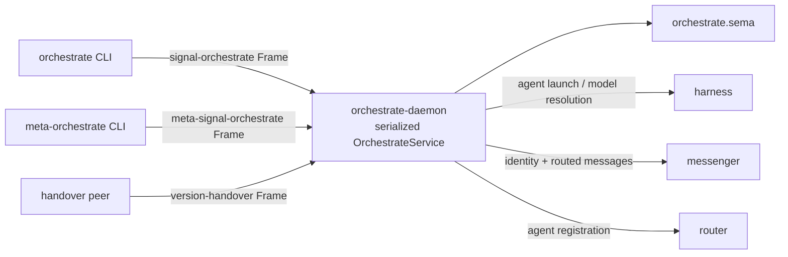

# orchestrate — architecture

Orchestrate is Persona's coordination mechanism: lanes, claims, handoffs,
activity, worktree declarations, workflow runs, agent identity, topic seating,
and orchestrator-message triage. Mind owns work-graph and policy truth;
Orchestrate owns the machinery that makes work proceed.

## Shape

The component has three process surfaces:

- `orchestrate-daemon` owns the durable `orchestrate.sema` store and all state
  transitions.
- `orchestrate` is the one-argument ordinary client.
- `meta-orchestrate` is the one-argument authority client.

The two public sockets consume their producer contracts directly:
`signal-orchestrate::OrchestrateFrame` on the ordinary socket and
`meta-signal-orchestrate::Frame` on the meta socket. The private upgrade socket
consumes `signal-version-handover::Frame`.


```mermaid
flowchart LR
    ordinary["orchestrate CLI"] -->|"signal-orchestrate Frame"| daemon
    meta["meta-orchestrate CLI"] -->|"meta-signal-orchestrate Frame"| daemon
    upgrade["handover peer"] -->|"version-handover Frame"| daemon
    daemon["orchestrate-daemon\nserialized OrchestrateService"] --> store["orchestrate.sema"]
    daemon -->|"agent launch / model resolution"| harness["harness"]
    daemon -->|"identity + routed messages"| messenger["messenger"]
    daemon -->|"agent registration"| router["router"]
```

Each accepted connection is bounded by the shared asynchronous
`triad-runtime` listener, an 8 MiB frame limit, and a ten-second read timeout.
The sockets are owner-only. A Tokio mutex serializes all three listener tiers
around the single `OrchestrateService`, so only one owner can observe or mutate
the Sema-backed state at a time.

## Interface ownership

The ordinary and meta contract repositories own the public interface in strict
Ethos. This runtime imports their generated Rust bindings and executes those
values directly. It does not own another request vocabulary, a contract
projection bridge, or local interface declarations.

This separation is deliberate:

- contract producers define what callers, agents, harnesses, and interfaces
  can say and see;
- this repository defines today's handwritten behavior for those contracts;
- `sema-engine` owns durable storage mechanics;
- `triad-runtime` owns reusable listener and framing mechanics.

Handwritten Rust is the truthful behavioral substrate today. It is not
presented as the permanent substrate of the interface.

## Request flow

For every socket exchange:

1. The listener reads one bounded length-prefixed body.
2. The owning contract rejects an empty or foreign contract binding before it
   decodes the archived body.
3. The listener requires a request frame, derives the route from its operation,
   and rejects any disagreement with the short-header route.
4. The listener retains that validated route and the exchange identifier.
5. `OrchestratorExecution` dispatches the canonical operation directly into
   the relevant Sema-backed ledger or service.
6. The daemon encodes the resulting `signal-frame::Reply` in the same contract,
   echoing the validated request route and exchange identifier, and writes one
   response body.

Ordinary and meta requests each contain exactly one operation. A multi-operation
request is rejected as a non-retryable, non-committed batch. Domain rejection
at the current service seam is returned as a committed `PartialApplied` reply;
malformed, unbound, route-incoherent, or wrong-tier frames fail before state
dispatch. The CLIs require the response to echo both request correlations
before accepting its payload.

## Ordinary authority

`signal-orchestrate` carries peer-callable work:

- claim, release, and handoff;
- observation of roles, sessions, lanes, worktrees, repositories, topics, and
  registered agents;
- activity submission and query;
- workflow execution, model-resolved workflow execution, and workflow-run
  observation;
- observation stream open and close;
- agent registration, identity minting, and launch;
- worktree request and conclusion;
- orchestrator-message triage and routing.

`RoleIdentifier`, `SessionIdentifier`, and `LaneIdentifier` are the one public
identity vocabulary. Dynamic roles and lanes are data, never closed runtime
enums.

## Meta authority

`meta-signal-orchestrate` carries owner-only changes:

- create and retire roles;
- register, unregister, retire, clear, and change authority for lanes;
- refresh the declared repository index;
- register, observe-refresh, and archive declared worktrees;
- exact registry-row maintenance.

`ForceRemoveRegistryRow` is present in the producer contract but currently
answers the typed `MetaOrchestrateRequestUnimplemented(NotBuiltYet)` reply.
Meta operations cannot be sent through the ordinary socket.

## Durable state

Only `orchestrate-daemon` opens `orchestrate.sema`. Its Sema families cover:

- roles, claims, lanes, sessions, and activity;
- declared repositories and worktrees;
- workflow model resolutions and receipts;
- agent identities, reachability, topics, and topic seats;
- message-triage audit records;
- downstream divergence records.

Sema supplies timestamps and commit ordering. Observations are pure reads of
durable rows. The runtime does not project claim files or treat repository
checkout state as a second state owner.

Each store family has exactly one live identity in this build. `sema-engine`
rejects any undeclared family identity before Orchestrate serves requests; this
crate carries no prior row shapes, rewrite path, or parallel store vocabulary.
The family descriptors describe persistent rows and are distinct from the
public programming interface.

## Host boundary

The daemon receives six absolute paths as positional startup arguments:

```text
orchestrate-daemon \
  <sema-store> <ordinary-socket> <meta-socket> <upgrade-socket> \
  <workspace-root> <git-index-root> \
  [router=<socket>] [messenger=<socket>]
```

The workspace and Git-index roots are used to derive typed report paths for
new roles. Orchestrate does not create those directories or repositories.
Repository refresh and worktree refresh observe durable declarations only;
they do not scan the host. `RequestWorktree` therefore returns the typed
`RepositoryNotFound` refusal, while meta `RegisterWorktree` records a complete
caller-supplied worktree fact. Archive and conclusion change durable state only.

## Cross-component effects

The orchestrator is the agent-identity mint. Minted and registered identities
are pushed to Messenger's durable consumer registry when configured. Agent
launches go through Harness; registrations are propagated to Router. Routed
orchestrator messages are written to the triage audit before their best-effort
Messenger hop.

An unavailable co-resident peer never silently rewrites a successful local
decision. The reply carries a named degradation or Orchestrate records a
divergence for later inspection.

## Handover

The private upgrade socket owns version-handover marker, readiness, completion,
and Mirror exchange. A Mirror snapshot contains active claims and lane
registrations, validates component, record kind, and target contract version,
then restores into the same Sema tables. Completion retires the ordinary and
meta socket paths.

## CLI presentation

An ordinary invocation such as:

```text
orchestrate '(Observe Lanes)'
```

selects the typed human presentation. Reader-facing ages are closed
`HumanReadableTime` values. Programs can request the unchanged contract reply:

```text
orchestrate '(Explicit (Canonical (Observe Lanes)))'
```

Presentation is a CLI concern only. Both forms send the same canonical
ordinary request to the daemon.

## Invariants

- The daemon is the sole state owner.
- Ordinary, meta, and upgrade vocabularies remain socket-separated.
- Public contract values execute directly.
- One service serialization point orders every state transition.
- Infrastructure mints timestamps, slots, and agent identities.
- A caller-visible partial effect is named and recorded.
- Orchestrate never polls a peer for state that peer can push.
- Repository and worktree host mutation is outside this source boundary.

## Code map

```text
src/daemon.rs                    direct ordinary/meta/upgrade listener runtime
src/execution.rs                 canonical operation dispatch
src/service.rs                   sole state owner and handover machine
src/tables.rs                    Sema-backed row families and store evolution
src/claim.rs                     claims, releases, handoffs, role observation
src/lane.rs                      lane/session lifecycle and observation
src/worktree.rs                  declared worktree lifecycle
src/workflow.rs                  workflow execution and receipts
src/orchestrator_presentation.rs CLI-only human rendering
src/signal_transport.rs          thin ordinary and meta clients
src/handover.rs                  Mirror capture, validation, and restoration
```

## See also

- `../signal-orchestrate/ARCHITECTURE.md` — ordinary contract.
- `../meta-signal-orchestrate/ARCHITECTURE.md` — meta contract.
- `../sema-engine/ARCHITECTURE.md` — durable storage engine.
- `../triad-runtime/ARCHITECTURE.md` — shared daemon runtime.
