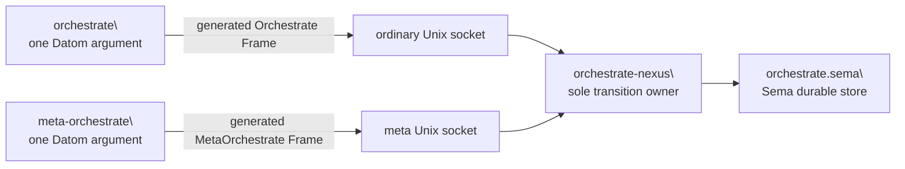

# Orchestrate Nexus — architecture

Orchestrate Nexus is a small PathLock Nexus. It deliberately has one authoritative
durable state owner and no lane, claim-file, worktree, workflow, upgrade, or
peer-coordination machinery.

## Process boundary


```mermaid
flowchart LR
    ordinary["orchestrate\\none Datom argument"] -->|"generated Orchestrate Frame"| normal["ordinary Unix socket"]
    meta["meta-orchestrate\\none Datom argument"] -->|"generated MetaOrchestrate Frame"| privileged["meta Unix socket"]
    normal --> nexus
    privileged --> nexus["orchestrate-nexus\\nsole transition owner"]
    nexus --> store["orchestrate.sema\\nSema durable store"]
```

The ordinary and meta sockets use different Ethos-generated contracts:
`signal-orchestrate` (ordinary contract id 1, wire revision 4) and
`meta-signal-orchestrate` (meta contract id 2, wire revision 3). Handwritten
code only dispatches the generated typed values and performs Unix transport;
it does not declare a fallback contract or codec.

Each accepted Unix connection carries exactly one length-prefixed generated
frame and one reply. Framing rejects empty or oversized bodies before generated
frame decoding. Socket handlers share the one mutex-protected durable store,
which serializes state transitions across both authority tiers.

## State and rules

The Sema store persists the startup `Configure` value and normalized complete
`PathLock` rows. `Register(PathLock)` rejects an active duplicate name and any
active overlapping absolute path. `Release(PathLockRelease)` removes a current
row or returns the generated unknown-name refusal. These domain outcomes are
typed contract replies, not transport or storage errors.

Meta `Configure(Configure)` validates the live configuration against the
persisted startup configuration. The POC keeps bound socket and store paths
stable: a changed store is `StorePathImmutable`; any other changed value is
`InvalidConfiguration`. It never silently rebinds a socket or changes a store
while serving.

## Startup and CLI boundaries

The Nexus takes a single URL-safe-unpadded-base64 argv argument. It immediately
decodes it as one generated meta request frame and requires `Configure`. Base64
solves the OS argv NUL restriction only; the Nexus wire boundary remains the
generated binary Signal frame.

Both clients accept exactly one concrete Datom carrier value and no flags. The
ordinary client accepts `PathLock.{...}` or `PathLockRelease.{...}`, wraps it
in the generated ordinary operation, and prints only the concrete reply
carrier. `meta-orchestrate` accepts `Configure.{...}` and does the analogue on
the meta socket. The component-specific `meta-orchestrate` name is intentional:
the recorded Orchestrate restoration evidence is more specific than the generic
component naming convention, so there is no compatibility alias.

## Code map

```text
src/main.rs                  Orchestrate Nexus startup frame validation and runtime launch
src/store.rs                 durable PathLock/configuration transitions
src/transport.rs             generated framed Unix request/reply transport
src/bin/orchestrate.rs       thin ordinary textual client
src/bin/meta_orchestrate.rs  thin meta textual client
tests/live_nexus.rs          live Orchestrate Nexus and two-client behavioral proof
```

## Verification

The live proof starts Orchestrate Nexus with a temporary store and separate normal and
meta sockets, then checks register, duplicate-name refusal, overlap refusal,
release, re-registration, and a meta Configure round trip through the real CLI
binaries. It runs under Cargo and as the `live-nexus` Nix check.
