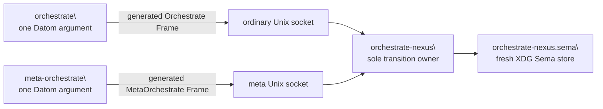

# Orchestrate Nexus — architecture

Orchestrate Nexus is a small Lock Nexus. It deliberately has one authoritative
durable state owner and no lane, claim-file, worktree, workflow, upgrade, or
peer-coordination machinery.

## Process boundary


```mermaid
flowchart LR
    ordinary["orchestrate\\none Datom argument"] -->|"generated Orchestrate Frame"| normal["ordinary Unix socket"]
    meta["meta-orchestrate\\none Datom argument"] -->|"generated MetaOrchestrate Frame"| privileged["meta Unix socket"]
    normal --> nexus
    privileged --> nexus["orchestrate-nexus\\nsole transition owner"]
    nexus --> store["orchestrate-nexus.sema\\nfresh XDG Sema store"]
```

The ordinary and meta sockets use different Ethos-generated contracts:
`signal-orchestrate` (ordinary contract id 1, wire revision 5) and
`meta-signal-orchestrate` (meta contract id 2, wire revision 4). Handwritten
code only dispatches the generated typed values and performs Unix transport;
it does not declare a fallback contract or codec.

Each accepted Unix connection carries exactly one length-prefixed generated
frame and one reply. Framing rejects empty or oversized bodies before generated
frame decoding. Socket handlers share the one mutex-protected durable store,
which serializes state transitions across both authority tiers.

## State and rules

The Sema store persists the executable-derived or meta-updated `Configure` value,
normalized complete `Lock` rows, and the next Nexus-assigned `LockId`. A `Lock`
request atomically acquires its complete normalized path set or returns a typed
duplicate-name or overlapping-path refusal. `Release(LockId)` removes exactly
that durable identity or returns the generated unknown-ID refusal. `Observe.Locks`
returns one complete point-in-time `LockSnapshot`, canonically
ordered by Lock name and then Lock ID. These domain outcomes are typed contract
replies, not transport or storage errors.

`Lock` is the durable coordination fact: its `LockId`, name, Flow attribution,
paths, and reason are both persisted and returned in `Locked` and `Released`.
The Nexus assigns IDs durably and never reuses them. `FlowId` is attribution,
not authorization; release is cooperative. There is no force release and no
automatic release in this revision.

The ordinary ontology is explicit in code: `Locks`, `Releases`, and `Observes`
are implemented by the single `OrchestrateStore` owner. Transport invokes its
ordinary dispatcher; it does not duplicate domain decisions.

The ordinary wire upgrade is clean. On a pre-1/5 store, startup detects active
old rows and refuses service until they have been released under the prior
Nexus. It never invents a Flow ID for old state. Once quiescent, durable
configuration may be retained but old ordinary rows are not carried forward.

The executable owns the fixed per-user Sema location. It derives the first
configuration from XDG state and runtime roots, persists it in a new store, and
always opens that same derived store on later starts. Meta `Configure(Configure)`
persists replacement socket paths for the next start. It never silently rebinds
the sockets of a running Nexus.

## Startup and CLI boundaries

The Nexus takes zero arguments. `DefaultConfiguration` in the executable derives
`$XDG_STATE_HOME/orchestrate-nexus/orchestrate-nexus.sema` (falling back to
`$HOME/.local/state`) and the two `$XDG_RUNTIME_DIR/orchestrate-nexus` socket
paths. The startup boundary is therefore local executable configuration, while
the socket boundaries remain generated binary Signal frames.

Both clients accept exactly one concrete Datom carrier value and no flags. The
ordinary client accepts the generated type-directed `Operation` root (`Lock`,
`Release`, or `Observe`) and prints the typed reply's structural debug
representation rather than defining a reply-text codec. Its canonical
observation input is `Observe.Locks`.
It has no Dotos parser or prior-operation fallback. `meta-orchestrate` accepts
`Configure` and does the analogue on the meta socket. The component-specific
`meta-orchestrate` name is intentional:
the recorded Orchestrate restoration evidence is more specific than the generic
component naming convention, so there is no compatibility alias.

## Code map

```text
src/defaults.rs              executable-owned XDG default derivation
src/main.rs                  zero-argument startup and runtime launch
src/ordinary.rs              Lock/Release/Observe trait and type ontology
src/store.rs                 durable Lock/configuration transitions
src/transport.rs             generated framed Unix request/reply transport
src/bin/orchestrate.rs       thin ordinary textual client
src/bin/meta_orchestrate.rs  thin meta textual client
tests/ordinary_lock_contract.rs store-level Lock behavioral proof
tests/live_nexus.rs          live Orchestrate Nexus and two-client behavioral proof
```

## Verification

The live proof starts Orchestrate Nexus under isolated XDG roots, then checks
first-store defaults, zero-argument startup, argument rejection, meta mutation,
restart-resume, Lock/Release/Observe behavior, and the clean-store transition.
It runs under Cargo and as the `live-nexus` Nix check.
