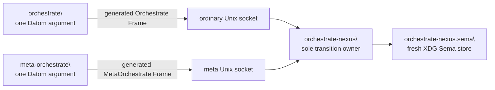

# Orchestrate Nexus — architecture

Orchestrate Nexus is a small PathLock Nexus. It deliberately has one authoritative
durable state owner and no lane, claim-file, worktree, workflow, upgrade, or
peer-coordination machinery.

## Process boundary


```mermaid
flowchart LR
    ordinary["orchestrate\\none Datom argument"] -->|"generated Orchestrate Frame"| normal["ordinary Unix socket"]
    meta["meta-orchestrate\\none Datom argument"] -->|"generated MetaOrchestrate Frame"| privileged["meta Unix socket"]
    normal --> nexus
    privileged --> nexus["orchestrate-nexus\\nsole transition owner"]
    nexus --> store["orchestrate-nexus.sema\\nfresh XDG Sema store"]
```

The ordinary and meta sockets use different Ethos-generated contracts:
`signal-orchestrate` (ordinary contract id 1, wire revision 4) and
`meta-signal-orchestrate` (meta contract id 2, wire revision 4). Handwritten
code only dispatches the generated typed values and performs Unix transport;
it does not declare a fallback contract or codec.

Each accepted Unix connection carries exactly one length-prefixed generated
frame and one reply. Framing rejects empty or oversized bodies before generated
frame decoding. Socket handlers share the one mutex-protected durable store,
which serializes state transitions across both authority tiers.

## State and rules

The Sema store persists the executable-derived or meta-updated `Configure` value and normalized complete
`PathLock` rows. `Register(PathLock)` rejects an active duplicate name and any
active overlapping absolute path. `Release(PathLockRelease)` removes a current
row or returns the generated unknown-name refusal. These domain outcomes are
typed contract replies, not transport or storage errors.

The executable owns the fixed per-user Sema location. It derives the first
configuration from XDG state and runtime roots, persists it in a new store, and
always opens that same derived store on later starts. Meta `Configure(Configure)`
persists replacement socket paths for the next start. It never silently rebinds
the sockets of a running Nexus.

## Startup and CLI boundaries

The Nexus takes zero arguments. `DefaultConfiguration` in the executable derives
`$XDG_STATE_HOME/orchestrate-nexus/orchestrate-nexus.sema` (falling back to
`$HOME/.local/state`) and the two `$XDG_RUNTIME_DIR/orchestrate-nexus` socket
paths. The startup boundary is therefore local executable configuration, while
the socket boundaries remain generated binary Signal frames.

Both clients accept exactly one concrete Datom carrier value and no flags. The
ordinary client accepts `PathLock.{...}` or `PathLockRelease.{...}`, wraps it
in the generated ordinary operation, and prints only the concrete reply
carrier. `meta-orchestrate` accepts `Configure.{...}` and does the analogue on
the meta socket. The component-specific `meta-orchestrate` name is intentional:
the recorded Orchestrate restoration evidence is more specific than the generic
component naming convention, so there is no compatibility alias.

## Code map

```text
src/defaults.rs              executable-owned XDG default derivation
src/main.rs                  zero-argument startup and runtime launch
src/store.rs                 durable PathLock/configuration transitions
src/transport.rs             generated framed Unix request/reply transport
src/bin/orchestrate.rs       thin ordinary textual client
src/bin/meta_orchestrate.rs  thin meta textual client
tests/live_nexus.rs          live Orchestrate Nexus and two-client behavioral proof
```

## Verification

The live proof starts Orchestrate Nexus under isolated XDG roots, then checks
first-store defaults, zero-argument startup, argument rejection, meta mutation,
restart-resume, registration, and release through the real CLI binaries. It
runs under Cargo and as the `live-nexus` Nix check.
